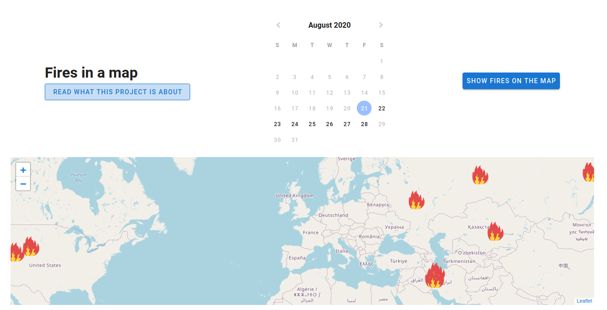

# Fires-Leaflet - with Vue.js
You can try the app [here](https://fires-on-a-map.netlify.app/)
## Premise
Every day somewhere in the world a fire takes place. It can be caused by various causes both natural and by man. Thus, for some years now, thanks to its satellites and to help local authorities, NASA has been monitoring the global situation and automatically identifies and reports fires on the entire planet. 
## What is this
This is a web application, which shows on a map the fires in the week of 21 to 28 August 2020.
## What i used
* Vue.js
* Vuetify
* Leaflet
### Preview

## Contact
You can find me here:

IG: [@emmanuele.online](https://www.instagram.com/emmanuele.online/)

Personal Page: [www.emmanuele.xyz](htpps://www.emmanuele.xyz)